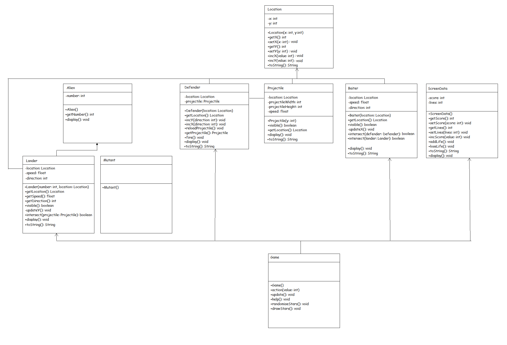
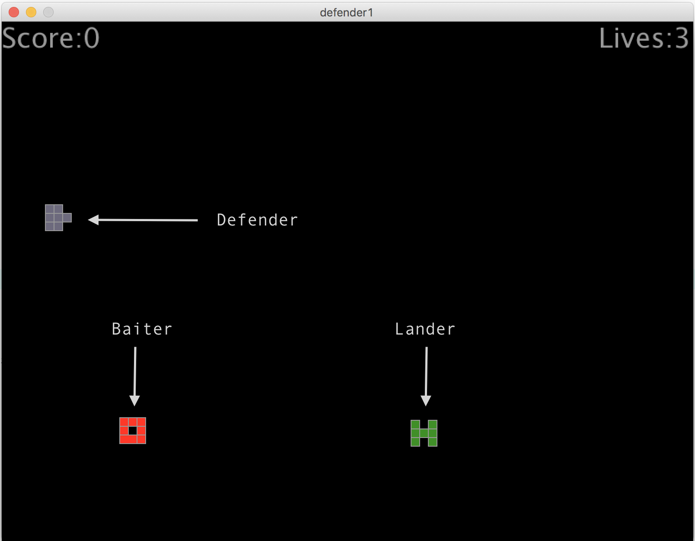
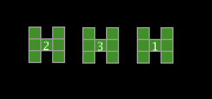
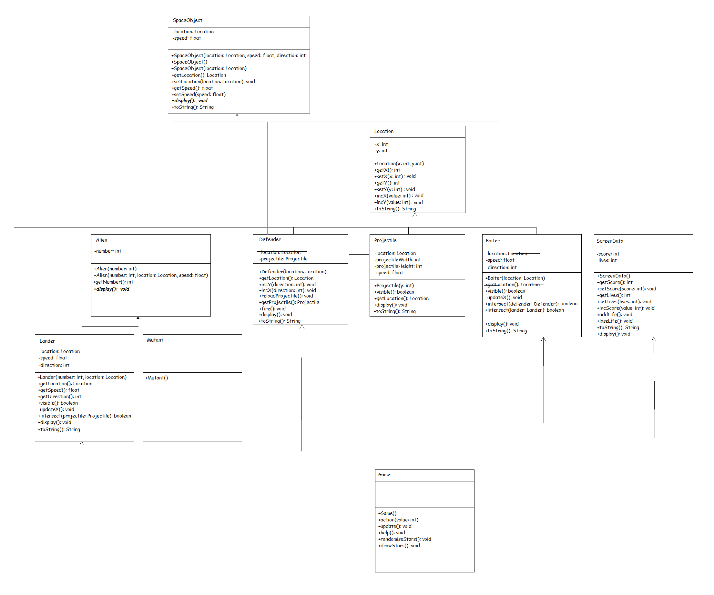
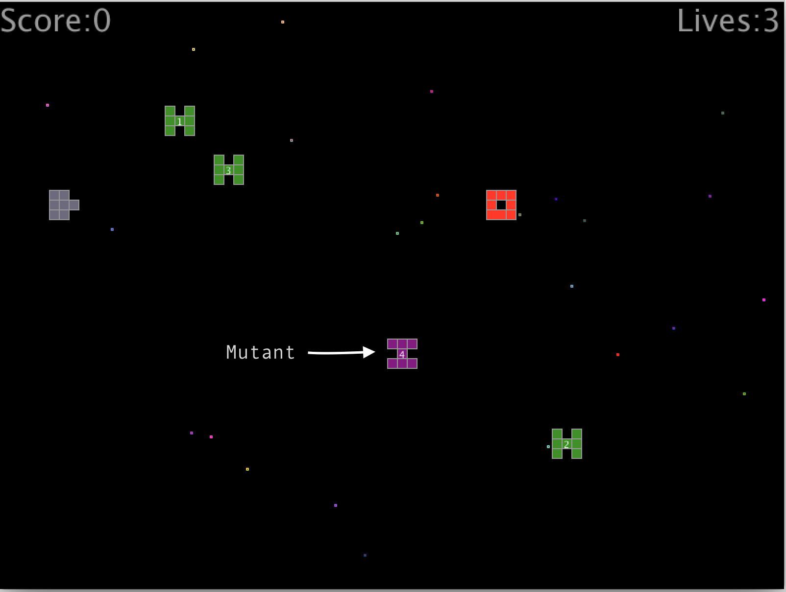

# Assignment 4 - Defender

## Contents

- [Part 1](#part-1) [29%]
- [Part 2](#part-2) [30%]
- [Part 3](#part-3) [11%]
- [Part 4](#part-4) [11%]
- [Part 5](#part-5) [19%]

## Submission Details

The deadline for electronic submissions is midnight Friday 13th December 2024.  Submit your code via the link on BlackBoard.


**A note on plagiarism and cheating**

If any of the code submitted by you is deemed copied from or by someone else it will be formally 
reported to the Head of School of Science and a Disciplinary Committee will be convened to deal with this issue.  You do not want that to happen!!

Never copy code from someone else or another source. Never give your code to someone else. Keep your
code safely in your own possession. Plagiarism and cheating are very serious academic offenses
with serious consequences for your future academic studies and work opportunities. Under
current guidelines all students involved in plagiarism or cheating must be reported to the Head
of School where a Disciplinary Committee will deal with the issue.


## Introduction

Note: For each part you should have separate folders (``defender1``, ``defender2``, etc). 
Some of the classes you create in one part may be copied into another (and perhaps modified for the purposes of that part).


## Part 1 – `ScreenData`, ArrayList, etc

Get the project folder ``defender1`` [here](./resources/defender1.zip). 

**Follow the instructions below precisely**.  Any deviation from this will mean you will lose marks.

This class diagram shows the structure of this part of the assignment when completed.


**Figure 1.1 - Class Diagram 1**

Run the Defender game.  


**Figure 1.2 - `defender1`**

You'll see a *Defender* at the left side of the screen that you can move up and down, an alien *Lander* moving down the screen and perhaps a *Baiter* moving right to left across the screen.  Take time to **examine and understand this code thoroughly**.  When you are ready begin the exercises below.


1.	Examine the ``ScreenData`` class in Figure 1.1 shown above.  It contains:

	-	2 private instance variables - ``score`` and ``lives``
	-	a constructor that initialises those variables
	-	7 getter, setter and incrementer methods 
	-	a ``display()`` method that should print the score and lives info at the top of the screen
	-	a ``toString()`` method that should return data in this format - `[ScreenData:score=0, lives=3]`

	a.	Write the missing code for the getters, setters, incrementers and `toString()`.

	Test your solution by uncommenting the following tester code in the project `setup()` method:

	```java
	println();
	println("==ScreenData==");
	ScreenData screenData = new ScreenData();
	println(screenData);
	screenData.setScore(100);
	screenData.incScore(10);
	println("score="+screenData.getScore());
	screenData.setLives(3);
	screenData.addLife();
	screenData.addLife();
	screenData.loseLife();
	println("lives="+screenData.getLives());
	println(screenData);

	```

	It should print:

	```java
    [ScreenData:score=0, lives=3]
    score=110
    lives=4
    [ScreenData:score=110, lives=4]

	```

	Make sure it prints this using the tester code provided.  Marks are lost if you don't pay attention to detail including spacing, brackets, etc.

1.	Provide the appropriate ``toString()`` methods shown for the other classes in the Figure 1.1.  The following are examples of the output expected:

	```
	[Baiter:location=[Location:x=0, y=0], speed=8.0, direction=-1]
	[Defender:location=[Location:x=0, y=0], projectile=[Projectile:x=0, y=0]]
	[Lander:number=1 ,location=[Location:x=0, y=0], speed=2.0, direction=1]
	[Location:x=0, y=0]
	[Projectile:location=[Location:x=0, y=0], projectileWidth=30, projectileHeight=1, speed=16.0]

	```

	Again, pay attention to detail shown here.

1.	In the `Game` class you'll see a method called ``randomiseStars()``.  This method generates 25 random (x,y) locations used to draw stars at those locations.  In the method `drawStars()` provide the code to draw a star at each of those 25 locations.  The star colours should be random.  Also, make the stars twinkle!

1.  In the game so far there is only one alien (i.e. *lander*) being displayed. We'll modify the ``Game`` class so an arraylist containing 3 *landers* can be displayed at a time.  We will:
    -   create an arraylist of `Lander` objects
    -   add 3 `Lander` objects to the arraylist
    -   display the *landers*
    -   check if any *lander* in the arraylist goes off-screen
	-   check if any *lander* in the arraylist collides with a projectile

    a.	First, comment out (remove) the lander object *declaration* and add an arraylist *declaration* like this:

    ```java
    //private Lander lander;
    private ArrayList<Lander> landers;

    ```

    b.   In `Game()` constructor, comment out the code that creates the single lander and add code to *create* the ``landers`` arraylist 

    c.   Update the code to add 3 lander objects to the arraylist ``landers``.  Make sure each lander is numbered 1 to 3.
    
	d.   In `update()` method, comment out the code that displays the single lander and add code that displays all lander objects (use an enhanced for loop)
    
	e.   At the label *Part 1 (lander off-screen)*, update the code to check if any landers go off-screen.  When a lander goes off-screen remove the lander from the arraylist using code like this:
	
	```java
	landers.remove(tmpLander);	
	```

	and respawn (re-create) the lander again to reappear at the top of the screen.

	f.   At the label *Part 1 (projectile collisions with Lander)*, update the code to check for a projectile colliding with any lander objects in the arraylist.  The code is similar to the code solution used above in (e).  If a projectile hits a lander respawn (re-create) the lander again to reappear at the top of the screen.

    When completed you should have 3 lander aliens appearing in the game constantly.

1.  You'll have noticed that if you miss when firing a projectile you cannot fire another projectile. At the label *Part 1 (reload)* in the ``Game`` class reload the defender projectile only when a missed projectile goes beyond the right of the screen.

1.  `Lander` objects each have a unique number assigned to them when created.  Update the `display()` method in `Lander` to show the lander number like this:

	

	**Figure 1.3 - Lander numbers**

1.  When a projectile collides with an lander, briefly change the background color of the screen to green.  You should see a green flashing at the moment alien is shot/disappears.


See video [here](https://media.heanet.ie/page/5d4afb9396ee4d3f99e6839d404b0ebd) for a demo of how Part 1 should look when done.


## Part 2 - `SpaceObject` abstract class

Only begin this part when you have completed or attempted all you can of *Part 1*.  

Make a copy of your ``defender1`` project folder, paste and rename it ``defender2``.  Use ``defender2`` for this part of the assignment.  You will need to rename the tester program for this part to ``defender2``.

1.	Create a new class called ``SpaceObject`` as shown in this class diagram:

	

	**Figure 2.1 - Class Diagram 2**

	It contains:

	-	2 **private** instance variables - ``Location`` and ``speed``
	-	a default constructor that initialises those variables:
		```java
		this.location=new Location(0,0);
    	this.speed=1.0;
		```

	-	some overloaded constructors that initialises those variables with specific values passed as arguments
	-	4 getter and setter methods 
	-	a ``toString()`` method that returns a string in this format:
	
		```
		[SpaceObject:location=[Location:x=0, y=0], speed=1.0]
		```

	a.	Write the missing code for the constructors, getters, setters and ``toString()``. 

	b.	Test your solution by uncommenting the following tester code in the project `setup()` method:

	```java
	println();
	println("==SpaceObject1==");
	SpaceObject spaceObject1 = new SpaceObject(new Location(100,100));
	println(spaceObject1);
	spaceObject1.setLocation(new Location(200,200));
	println(spaceObject1.getLocation());
	println();
	println("==SpaceObject2==");
	SpaceObject spaceObject2 = new SpaceObject(new Location(0,0),2.0);
	println(spaceObject2);
	spaceObject2.setSpeed(spaceObject2.getSpeed()*2);  
	println(spaceObject2);

	```
	It should print:
	
	```java
	==SpaceObject1==
	[SpaceObject: location=[Location:x=100, y=100], speed=1.0]
	[Location:x=200, y=200]

	==SpaceObject2==
	[SpaceObject: location=[Location:x=0, y=0], speed=2.0]
	[SpaceObject: location=[Location:x=0, y=0], speed=4.0]
	```

	Make sure it prints this using the tester code provided.  Again, pay attention to the detail.

1.	Make the ``SpaceObject`` class ``abstract``.  Some code in the project ``setup()`` method will need to be commented out again.

1.	Add the abstract method ``display()`` to ``SpaceObject``:

	```java
	public abstract void display();

	```

1.	``SpaceObject`` now provides one class for the instance variables - ``location`` and ``speed`` and it's various methods.  Have the classes in the project that use these variables **inherit** them from ``SpaceObject``.  This includes the classes - ``Alien``, ``Baiter``, ``Defender``, and ``Projectile``.

1.	Identify and remove all *shadow instance variables* and *shadow instance methods* from these subclasses.  Remove them from the ``Lander`` class too.  

	For example, in the ``Baiter`` class comment out the class variables `location` and `speed`:
	```java
	//private Location location; 
	//private float speed;   
	private int direction;
	```

	We will leave ``direction`` alone even though it is a candidate variable that should be moved to ``SpaceObject`` too.

	These changes will cause lots of compilation errors in your subclasses now.  Update each of the appropriate subclasses one at a time and fix these errors.  Be careful, especially in `display()` methods.

	When finished there should be no shadow instance variables or methods in any subclass of ``SpaceObject``.  Test the game still works.

1.	In the constructors for the classes ``Baiter``, ``Defender``, ``Projectile``, and ``Lander`` use the appropriate inherited constructors from ``SpaceObject`` and `Alien` to initialise the class instance variables.

1.	The `Alien` class should not implement the `display()` method.  Make the `display()` method abstract and remove it's code block.  You will need to update the class declaration.

1.	Move the following variable and methods from `Lander` to the parent class `Alien`:

	- `number;`
	- `getNumber()`
	- `visible()`

1.	Modify the code in the `Game` class at the label *Part 2 (lander collisions)* to check for ``Baiter`` collisions with ``Lander`` aliens. If a ``Baiter`` hits a lander:
	-	briefly change the background colour to green
	-	remove the lander 
	-	respawn the lander again to reappear at the top of the screen.

<!-- 1.	More??? -->

See video [here](https://media.heanet.ie/page/bae3bfe115364d5caa35e2a00a3291e6) for an example of how Part 2 should run when done.


## Part 3 - `InvalidDefenderLocationException`

Only begin this part when you have completed or attempted all you can of *Part 2*.  

Make a copy of your ``defender2`` project folder, paste and rename it ``defender3``.  Use ``defender3`` for this part of the assignment.  You will need to rename the tester program for this part to ``defender3``.

1.	Create a class called ``InvalidDefenderLocationException``.  See the Java Doc file [here](https://lyitbb.blackboard.com/bbcswebdav/courses/OOPR_IT603_2024_CL/a4/InvalidDefenderLocationException.html).  You MUST create the class exactly as required in the Java documentation given.  Pay attention to inheritance, constructors and methods in this class.

1.	You should have noticed that the defender is placed at (x=Game.DEFENDER_X, y=random(0, height)).

	Modify the constructor in ``Defender`` to throw an ``InvalidDefenderLocationException`` if an off-screen (x,y) value is passed to the constructor.  Throw this exception if any (x,y) value is less that 0 or greater than the screen width or height respectively.
	
	These changes will cause errors in the ``Game`` class.  Fix them by using an appropriate ``try..catch`` statement using the new exception.  If an `InvalidDefenderLocationException` exception is thrown when creating a `Defender` object in `Game` print the message returned by the exception class **and** stop the program by using the ``exit()`` method.  Therefore, if an invalid (x,y) is given for a defender the game/program should stop.  Test your new exception works by using some off-screen values for the defender.

See video [here](https://media.heanet.ie/page/222fdf8c7c5e43839f2245070521d04f) for an example of how Part 3 should run when done.


## Part 4 – Interface ``Blockable`` 

Only begin this part when you have completed or attempted all you can of Part 3.

Make a copy of your ``defender3`` project folder, paste and rename it ``defender4``. Use ``defender4`` for this part of the assignment. You will need to rename the tester program for this part to ``defender4``.

1.	Create an interface called ``Blockable`` See the Java Doc file [here](https://lyitbb.blackboard.com/bbcswebdav/courses/OOPR_IT603_2024_CL/a4/Blockable.html)

1.	Provide the appropriate implementation of ``Blockable`` in the ``Baiter`` class.

	The ``blocksProjectile()`` method should determine if the projectile collides with a baiter. You've done this before for collisions between baiter and landers.

	You will need to update the code in ``Game`` at the label *Part 5 (projectile collisions with Baiter)* to use the new ``blocksProjectile()`` method every time after displaying the projectile.  If a collision is detected with a baiter:
	
	- remove the projectile but not the Baiter
	- reload the defender projectile
	- briefly change the background colour to red

	This code solution will require a good amount of independent work.

1.	At the moment the baiter appears at a random location along the y plane.  Change this so the baiter appears at the same y location as the defender.  

See video [here](https://media.heanet.ie/page/5ee139c329534fd48830d5e515bfc10e) for an example of how Part 4 should run when done.


## Part 5 – `Mutant`, Scores and `Baiter`

Only begin this part when you have completed or attempted all you can of Part 4.

Make a copy of your ``defender4`` project folder, paste and rename it ``defender5``. Use ``defender5`` for this part of the assignment. You will need to rename the tester program for this part to ``defender5``.  



**Figure 5.1 - `defender5`**

1.	Earlier we seen the in Figure 2.1 that ``Mutant``is also a subclass of ``Alien``.  This class will be used to implement another type of alien in the game.  Using ``Lander`` as a guide, complete the code needed to implement the `Mutant` class.  Make the appropriate updates in the `Mutant` class `display()` method to show mutant like image above.

1.	When both classes above are completed comment out (remove) the ``landers`` arraylist declaration and add an new generic ``aliens`` arraylist declaration like this:

	```java	
	// private ArrayList<Lander> landers;
	private ArrayList<Alien> aliens;

	```

	This new arraylist will be used to store both types of alien objects - 3 ``Lander`` aliens and 1 ``Mutant`` alien.  
	
	You will need to comment out (remove) the code that created lander objects and create all the aliens using this code:

	```java
	int alienCount=0;
    for (int i=0; i<Game.NO_OF_LANDERS; i++, alienCount++)
      aliens.add(new Lander(alienCount+1, new Location((int)random(ALIEN_X_MIN, ALIEN_X_MAX), 0)));    
    for (int i=0; i<Game.NO_OF_MUTANTS; i++, alienCount++)
      aliens.add(new Mutant(alienCount+1, new Location((int)random(ALIEN_X_MIN, ALIEN_X_MAX), 0)));
	
	```

	This change will require significant updates to the code in the ``Game`` class. Diligently make those updates to use the ``aliens`` arraylist from now on.

1.	You need to update and display a score whilst playing the game.  Scores are awarded for shooting aliens:

	| Event              | Score |
	| ------------------ | ----- |
	| Shoot Lander      |  100   |
	| Shoot Mutant         |  300   |

	You MUST use the ``ScreenData`` class ``display()`` method to display score.

1.	Update the code to check for a baiter colliding with the defender.  If a baiter collides with a defender:
	
	- briefly change the background colour to red	
	- remove the baiter
	- remove the defender and respawn at a random location
	- lose a life in the game

1.	Finally, the game should end immediately if you reach 0 (zero) lives.

See video [here](https://media.heanet.ie/page/f695f6b5cebe4502b9e1d14cf6a2ef10) for an example of how Part 5 should run when done.
